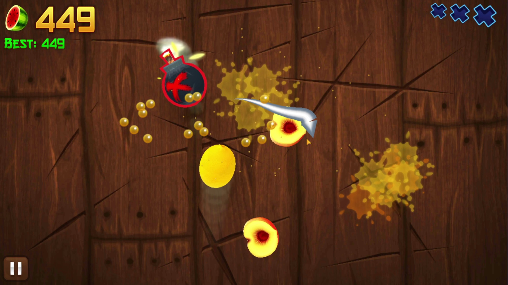
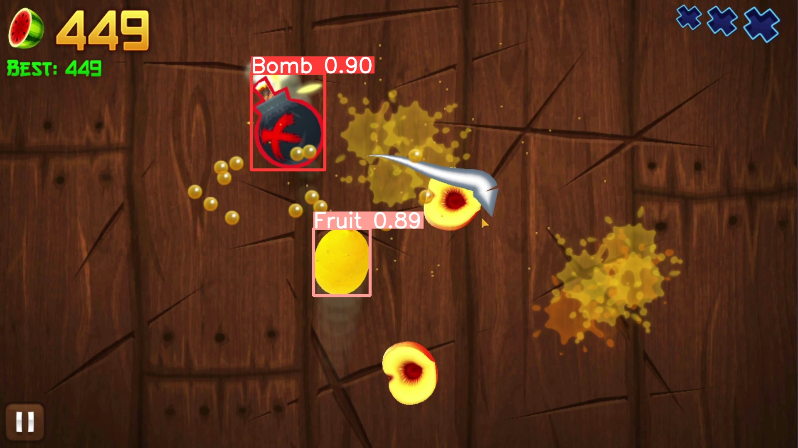

# Automation of Fruit Ninja with Image Recognition

## Pytorch must be installed seperate from requirements.txt due to different cuda versions. Go to [pytorch.org](https://pytorch.org/) to install your version.
### Tested and developed on Windows 11 with Python 3.10.5, CUDA 12.2, and Pytorch CUDA 12.1 Nightly Build.

**Press and hold 'q' on your keyboard to stop the main loop.**

Fruit Ninja was emulated using BlueStacksX. YOLO-V8 Nano was then used to detect fruits and bombs. Using this information, a path to slice through the fruits while avoiding bombs was found and executed.
The model used in the main program is a TensorRT model for fast inference.
**The the capture screen cordinates are based on a BlueStacks window maximized (not fullscreen) with the right BlueStacks sidebar minimized on a 1920x1080p monitor. Because of this, the screen dimensions in _main.py_ may have to be tested and changed to work with your monitor**

YoloV8Testing.py or view_data.py can be used to test inference and if your GPU is being detected.
The code for training a model is also included, however the custom FruitNinja dataset is not included due to its size but can be downloaded from [Roboflow](https://universe.roboflow.com/fruitninja-pjzb7/fruit-ninja-z0rqc).
